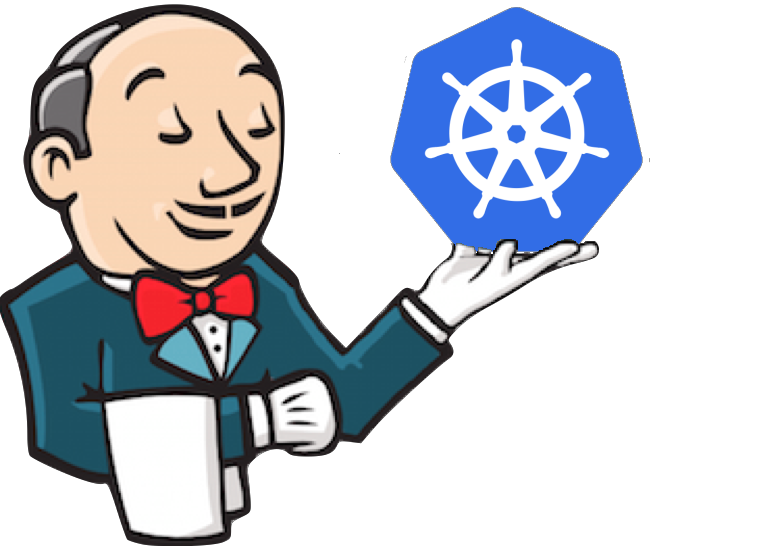
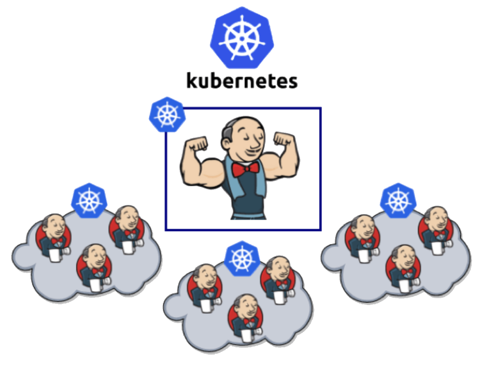
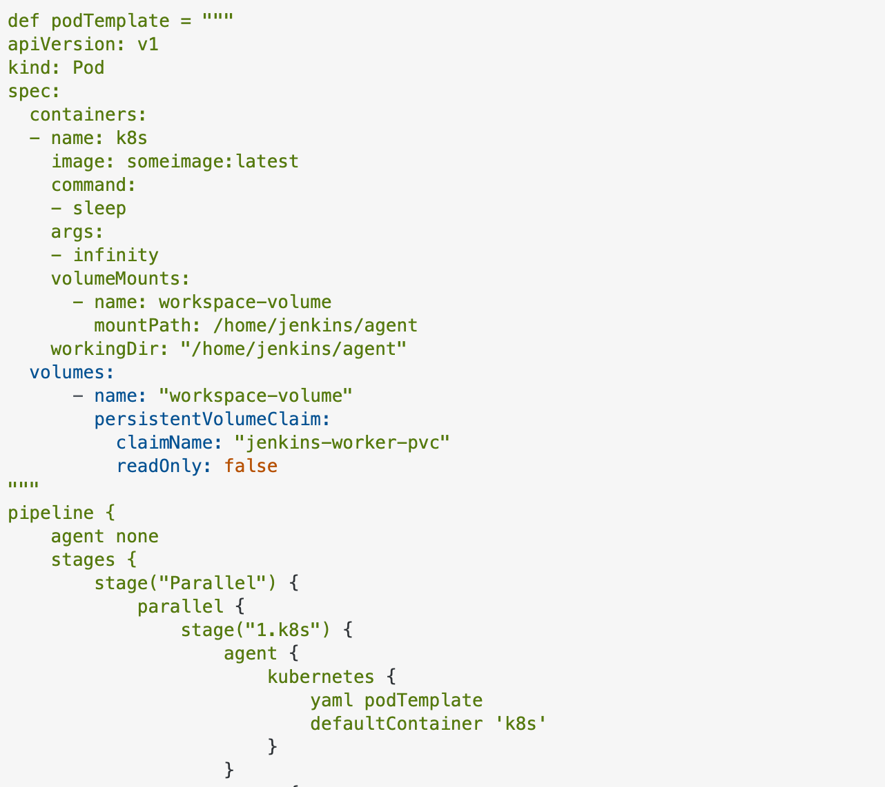

# **Resilient scalable build systems**



or: How I Learned to Stop Worrying and Love AWS

---

# What do we need to do?

- Build a resilient infrastructure platform
  - Orchestrator: Jenkins + EKS
  - Filesystem: EFS
  - Load balancer: Nginx ingress
- Put Jenkins on top of infra
- Talk about the ideology and other concerns
- Questions

---

# Why do we need to do better than running Jenkins on EC2?

- Jenkins does not support native high availability as a feature
- Why?
  - High availability
  - Shared persistence

---

# Lets build

- Build an EKS cluster
- Create an EFS file system
- Install the EFS CSI driver and set up AWS
- Deploy jenkins as a stateful set to k8s


---

# Things to keep in mind

- Avoid jenkins plugins as a general rule
  - Still you need some basic ones.
    - Kubernetes plugin
    - Remote jenkinsfiles plugin
    - git plugin
- eksctl - why?
  - Helper functions to do non-idempotent tasks in AWS/K8S


---

# Build an EKS cluster using eksctl

https://aws.amazon.com/blogs/storage/deploying-jenkins-on-amazon-eks-with-amazon-efs/

``` sh
eksctl create cluster --config-file cluster.yaml

aws eks update-kubeconfig --name demo-development01 --region us-east-2 --profile dev --kubeconfig ~/.kube/demo-development01.yaml

eksctl utils associate-iam-oidc-provider --region=us-east-2 --cluster=demo-development01
```

---

# Deploy EFS CSI driver on EKS part1

https://docs.aws.amazon.com/eks/latest/userguide/efs-csi.html

``` sh
aws iam create-policy \
    --policy-name AmazonEKS_EFS_CSI_Driver_Policy \
    --policy-document file://iam-policy-example.json

eksctl create iamserviceaccount \
    --cluster demo-development01 \
    --namespace kube-system \
    --name efs-csi-controller-sa \
    --attach-policy-arn arn:aws:iam::132476463554:policy/AmazonEKS_EFS_CSI_Driver_Policy \
    --approve \
    --region us-east-2
helm repo add aws-efs-csi-driver https://kubernetes-sigs.github.io/aws-efs-csi-driver/
helm repo update
```

---

# Deploy EFS CSI driver on EKS part2

``` sh
helm upgrade -i aws-efs-csi-driver aws-efs-csi-driver/aws-efs-csi-driver \
    --namespace kube-system \
    --set image.repository=602401143452.dkr.ecr.us-east-2.amazonaws.com/eks/aws-efs-csi-driver \
    --set controller.serviceAccount.create=false \
    --set controller.serviceAccount.name=efs-csi-controller-sa

kubectl apply -k "github.com/kubernetes-sigs/aws-efs-csi-driver/deploy/kubernetes/overlays/stable/?ref=master"

aws efs create-mount-target \
    --file-system-id $file_system_id \
    --subnet-id subnet-05cd8261e9174c73b \
    --security-groups $security_group_id

aws efs create-access-point --file-system-id fs-079c6b73e0a44d3d9 \
--posix-user Uid=1000,Gid=1000 \
--root-directory "Path=/jenkins,CreationInfo={OwnerUid=1000,OwnerGid=1000,Permissions=777}"
```

---

# Install Jenkins with PVC

- Make a storage class and persistent volume and PersistentVolumeClaim called efs-sc

``` sh
helm repo add jenkins https://charts.jenkins.io
helm repo update
helm install jenkins jenkins/jenkins -f values.yaml
```

- In values.yml  uid: 1000 / gid:1000

``` sh
kubectl logs jenkins-0 -c init --previous
disable Setup Wizard
/var/jenkins_config/apply_config.sh: 4: cannot create /var/jenkins_home/jenkins.install.UpgradeWizard.state: Permission denied
```

---

# Gradle / Caching and making it faster

GRADLE_HOME should be local to the job.

- With EFS job tests result directories can persist for a particular job if desired.
- Volumes on EFS can be shared on lots of pods 
- Don’t use SNAPSHOTS unless you are on a laptop.

---

# Jenkinsfiles

To remote or not to remote that is the question?
 - https://plugins.jenkins.io/remote-file/
## Kubernetes plugin.

- POD templates(labels).
- Configuration inheritance
- Defaults

---

# PodTemplate

``` sh

pipeline {
    agent {
      label "jenkins-maven"
    }
    environment {
      ...
    }
    stages {
      stage('CI Build and push snapshot') {
        steps {
          container('maven') {
            sh "mvn deploy"
          }


```

 

---

# Security on Jenkins

- Jenkins with matrix authorization rbac is a pain
- Use SAML if possible
  - https://github.com/jenkinsci/saml-plugin

- Cloudbees support for SAML is very good.

- Cloudbees support for plugins is great as long as you stay on them.

---

# Continuous integration 

- ephemeral environments
- testcontainers
  - https://www.testcontainers.org/
  - https://github.com/masinger/testcontainers-java/blob/master/docs/features/kubernetes.md
- Sidecars
- GitLab services

---

# Developer autonomy? DevOps?

https://www.slideshare.net/jallspaw/10-deploys-per-day-dev-and-ops-cooperation-at-flickr

---

# Other cool things

- Semantic-release Semantic-release-plus
  - https://github.com/semantic-release-plus/semantic-release-plus/

- Jenkins Job Builder
  - https://jenkins-job-builder.readthedocs.io/en/latest/

- nebula
  - https://nebula-plugins.github.io/